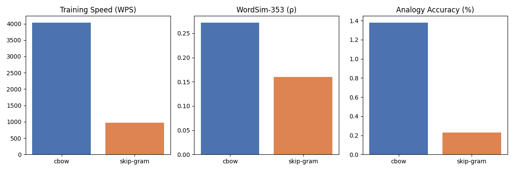

# Embeddings-Tournament

This is a pure NumPy implementation of both CBOW and Skip-Gram from the original paper:

[Efficient Estimation of Word Representations in Vector Space](https://arxiv.org/pdf/1301.3781)

[Distributed Representations of Words and Phrases and their Compositionality](https://arxiv.org/pdf/1310.4546)

| Architecture | Words/Sec | WordSim (ρ) | Analogy Acc |
|--------------|-----------|-------------|-------------|
| cbow         |   4,036   |    0.272    |    1.4%     |
| skip-gram    |     976   |    0.160    |    0.2%     |

As those results may seem surprising, especially in regards to the analogy accuracy, this is still a very small success rate. And from my understanding the skip-gram starts to perform with more epochs and training data, at least by looking at random graphs from much more sophisticated runs. Additionally, keeping in mind that it only trained on 1 epoch with 25MB of data due to time and computational constraints, this result is understandable. More minor experiments proved that both models are improving with more data, so the system is still training and tuning the embeddings.

### Datasets:
This model has been trained on the first n-MB od the [text8](https://www.kaggle.com/datasets/gupta24789/text8-word-embedding) (Wikipedia) lowercased words. For testing purposes it utilized the [wordsim353](https://gabrilovich.com/resources/data/wordsim353/wordsim353.html) and [questions-words](http://download.tensorflow.org/data/questions-words.txt) 